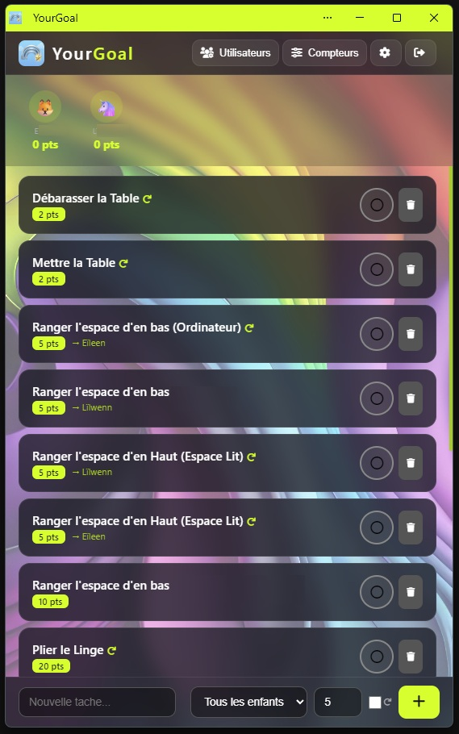

# YourGoal 🎯

> **Note** : Cette application a été réalisée intégralement en **Vibe Coding** via OpenCode + DeepSeek V4.



**YourGoal** est une application web de gestion de tâches et récompenses pour enfants. Les parents créent des tâches, les enfants les accomplissent, gagnent des points et les échangent contre des récompenses (temps d'écran, argent de poche, etc.).

## Table des matières

- [Fonctionnalités](#fonctionnalités)
- [Comment ça marche](#comment-ça-marche)
- [Guide utilisateur](#guide-utilisateur)
- [Stack technique](#stack-technique)
- [Installation](#installation)
- [Docker / ZimaOS](#docker--zimaos)

---

## Fonctionnalités

- **Tâches** — Création, cycle de validation complet (proposée → en cours → terminée → validée / refusée)
- **Tâches récurrentes** — Se réinitialisent automatiquement une fois les points récupérés
- **Points** — Gagnés sur validation des tâches, dépensés sur les compteurs
- **Compteurs** — Récompenses configurables (temps d'écran, MoneyWalky…) avec un prix en points
- **Alertes** — Les parents envoient un message à un enfant, qui le voit au prochain chargement
- **Avatars** — 30 émojis animaux au choix
- **Historique** — 40 dernières tâches complétées visibles par enfant
- **Multi-utilisateurs** — Rôles : admin, parent, enfant

---

## Comment ça marche

### Le cycle d'une tâche

1. Un **parent** crée une tâche (ex: "Ranger la chambre — 10 points")
2. L'**enfant** la voit et clique pour l'accepter → la tâche passe en "En cours"
3. L'enfant clique "J'ai terminé !" → la tâche passe en "Terminée" (jaune)
4. Le **parent** vérifie et clique **Valider** (vert) ou **Refuser** (rouge)
5. Si validée, l'enfant clique pour récupérer ses points → la tâche disparaît
6. Si la tâche est récurrente, elle revient automatiquement en "À faire"

### Les points & compteurs

- Chaque tâche validée rapporte des points
- Les points s'échangent contre des **compteurs** (ex: 30 min d'écran = 15 points)
- L'enfant achète directement depuis son interface
- Le parent voit les compteurs dans la fiche de l'enfant et peut décrémenter (ex: "Julie a utilisé 10 minutes")

### Alertes

- Le parent clique sur "Informer" à côté d'un compteur
- Il tape un message (ex: "Julie, il reste 5 minutes d'écran")
- Le message apparaît sur l'écran de l'enfant au prochain chargement

---

## Guide utilisateur

### Premier lancement

1. Ouvrez `http://localhost:5001`
2. Cliquez sur **S'inscrire**
3. Choisissez le rôle **Admin**
4. Créez votre compte (nom + mot de passe)

### Créer un enfant

1. Allez dans **Gestion Utilisateurs** (icône 👤)
2. Cliquez **Ajouter un enfant**
3. Donnez un nom et un mot de passe — il pourra se connecter avec ces identifiants

### Créer une tâche

1. Cliquez sur **Nouvelle tâche**
2. Tapez un nom (ex: "Ranger la chambre")
3. Choisissez les points (ex: 10)
4. Cochez 🔄 si la tâche est récurrente
5. Assignez-la à un enfant
6. Validez

### Gérer les compteurs

1. Cliquez sur l'icône d'un enfant
2. Allez dans l'onglet **Compteurs**
3. Cliquez **Ajouter un compteur**
4. Donnez un nom (ex: "Temps d'écran"), un prix (15), et une division (10 minutes)
5. L'enfant pourra l'acheter avec ses points

### Modifier les points manuellement

1. Cliquez sur l'icône d'un enfant
2. Allez dans **Points**
3. Tapez la nouvelle valeur et validez

---

## Stack technique

| Composant | Technologie |
|-----------|------------|
| Backend | Python / Flask |
| Frontend | HTML, JavaScript (IIFE) |
| Style | Glassmorphism, responsive |
| Stockage | Fichier JSON (`server_data.json`) |
| PWA | manifest.json, Service Worker |
| Conteneurisation | Docker |

---

## Installation

### Prérequis

- Python 3.x
- Flask (`pip install flask`)

### Lancement en développement

```bash
pip install -r requirements.txt
python server.py
```

Accès : `http://localhost:5001`

---

## Docker / ZimaOS

### Lancement avec Docker

```bash
docker-compose up -d
```

Accès : `http://votre-ip:5001`

### Déploiement ZimaOS

Voir le fichier `ZimaOS_Deploy.txt` pour la configuration détaillée.

---

## Structure du projet

```
YourGoal/
├── server.py              # Backend Flask
├── templates/
│   ├── login.html         # Page de connexion / inscription
│   └── index.html         # Application principale (PWA)
├── static/
│   ├── Rainbow.jpeg        # Fond d'écran
│   ├── Logo.png            # Logo de l'application
│   ├── favicon.ico         # Icône d'onglet
│   ├── manifest.json       # Manifeste PWA
│   └── sw.js               # Service Worker
├── Dockerfile              # Image Docker
├── docker-compose.yml      # Orchestration Docker
├── ZimaOS_Deploy.txt       # Instructions ZimaOS
├── requirements.txt        # Dépendances Python
└── .gitignore              # Fichiers ignorés
```
